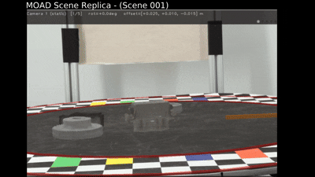

# Scene Replica MOAD

## Inspired by [SceneReplica](https://github.com/IRVLUTD/SceneReplica) and SceneReplica-related functionality from [ManipulationNet](https://github.com/ManipulationNet/mnet_client).
## Designed for scene replication using the [MOAD Data Collection Rig](https://www.robot-manipulation.org/nist-moad).  
This implementation removes the need for AprilTag registration, instead relying on known camera intrinsics/extrinsics and turntable position to reliably project scenes onto images collected using the MOAD rig.   
 
  

## Installation
You can install the dependencies with:

```bash
pip install opencv-python pybullet
```

## Usage

#### To view one of the example scenes:  
```python
python3 view_scene.py
```
Then in the terminal select which scene to view.   

#### To render a scene on top of MOAD images:
```python
python3 replica_live_viewer.py
```  
The primary purpose of this script is to visualize scenes on top of live views from the MOAD rig cameras in order to replicate a scene before scanning. If no live views are found, it will default to fallback static background images, but still use the camera parameters from the MOAD rig (examples of which can be found on the [MOAD Control Software Github](https://github.com/pgavriel/moad_cui)).  
Try using *--help* to see all the available parameters for setting paths.